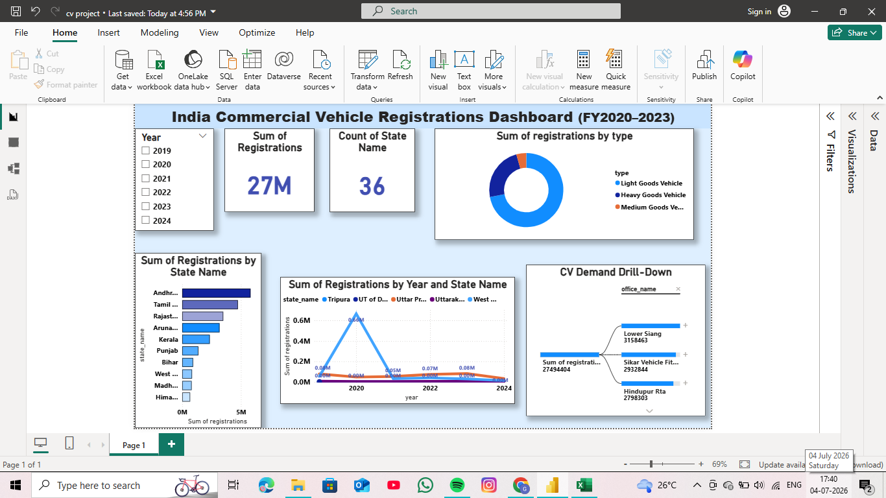

# india-cv-registrations-analytics

# India Commercial Vehicle Registrations Analytics

**Where is India's CV demand growing, and what does it mean for market/dealer strategy?**

An end-to-end analytics project (SQL → Python → Power BI) analyzing official Government
of India vehicle registration data to uncover state-level and RTO-level trends in
Commercial Vehicle (CV) demand.

---

## Business Question

Which states and RTOs are driving Commercial Vehicle registration growth in India, how
has CV demand trended over time, and what does this suggest about where dealers or
manufacturers should focus sales and re-enquiry efforts?

This project extends the CV sales-pipeline analysis work from my Tata Motors internship,
applied end-to-end and at a national scale.

---

## Key Findings

- **Andhra Pradesh** is the leading CV market overall, with **5.8M+ total registrations**
  in the analyzed period — followed by Tamil Nadu, Rajasthan, Arunachal Pradesh, and Kerala.
- **Chhattisgarh** stands out as the most consistently high-growth state, with **+69% YoY
  growth in 2022** and **+21% YoY growth in 2023** — sustained growth across two years,
  rather than a single-year spike.
- **Tripura** had the single highest YoY growth rate recorded (**+98% in 2022**), though
  this reflects a smaller base than larger states.
- CV registrations are split between **Heavy Goods Vehicles** and **Light Goods Vehicles**
  nationally (see `analysis_queries.sql`, Query 4, for the exact percentage split).
- National CV registration growth was strongest in 2022, moderating into 2023.

---

## Data Quality Notes

Real-world government data isn't clean out of the box — part of this project involved
identifying and correcting the following issues before trusting any growth metrics:

- **2019 data is unreliable as a growth baseline.** Several states (e.g., Arunachal Pradesh)
  show registration counts increasing 100x+ into 2020, most likely due to late onboarding
  onto the digital VAHAN system rather than genuine demand growth. 2019 was excluded from
  all year-over-year comparisons.
- **2024 data is incomplete** (only through May), so it was excluded from growth
  calculations to avoid comparing a partial year against a full one.
- **Final reliable window used for YoY growth analysis: 2020–2023** (with 2021–2023 used
  for the cleanest state-level comparisons).
- All growth calculations were recomputed using `PARTITION BY state_name` in SQL to ensure
  each state is compared only against its own prior year, not a national aggregate.

---

## Tools & Skills Used

- **SQL:** CTEs, window functions (`RANK`, `LAG`, `SUM() OVER`), partitioned aggregates,
  pattern matching — see `analysis_queries.sql`
- **Python:** pandas (cleaning, feature engineering), matplotlib/seaborn (visualization)
  — see the Jupyter notebook in this repo
- **Power BI:** interactive dashboard with drill-down (Decomposition Tree), KPI cards,
  treemap, donut chart, and slicers — see `cv project.pbix`

---

## Dashboard

*Dashboard includes: KPI cards (total registrations, active states), a donut chart
showing vehicle type mix (Light/Heavy/Medium Goods Vehicle), a state-wise bar chart,
a year-over-year trend line comparing top states, a Year slicer for interactive
filtering, and a Decomposition Tree for drilling down from total registrations
through RTO level.*

---

## Repository Contents

| File | Description |
|---|---|
| `analysis_queries.sql` | All 5 SQL queries used for state/RTO/growth analysis |
| `cv project.ipynb` | Python notebook — data cleaning, feature engineering, EDA |
| `cv_registrations_cleaned.csv` | Cleaned dataset (CV-only, post data quality fixes) |
| `cv project.pbix` | Power BI dashboard file |
| `dashboard_screenshot.png` | Dashboard preview image |
| `top_cv_states.png`, `cv_national_trend.png` | Supporting chart exports from Python |

---

## Data Source

Government of India, VAHAN Vehicle Registrations by Vehicle Category, via
[India Data Portal](https://ckandev.indiadataportal.com/dataset/vahan-vehicle-registrations)

---

## Author

**Greeshma Rao** · Data Analyst
